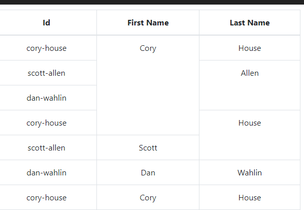

To install : npm install react-table-rowspan
For usage see demo folder inside src/demo

The purpose of this project is to create a component which receives a json formatted object and prints a table. Based on the structure of data it automatically adds rowspans to the table to make it look formatted. The user needs to do no configuration, just pass the json object and if the data is in a way that the columns in rows can be merged it is automatically done by the project.

To styke the table use classes: ar-table, ar-table-thead, ar-table-thead-row, ar-table-thead-header, ar-table-row, ar-table-col.

To run the project clone it and run this command in terminal "npm start". This will start the dev server on localhost:3000.

A sample output would be like :

